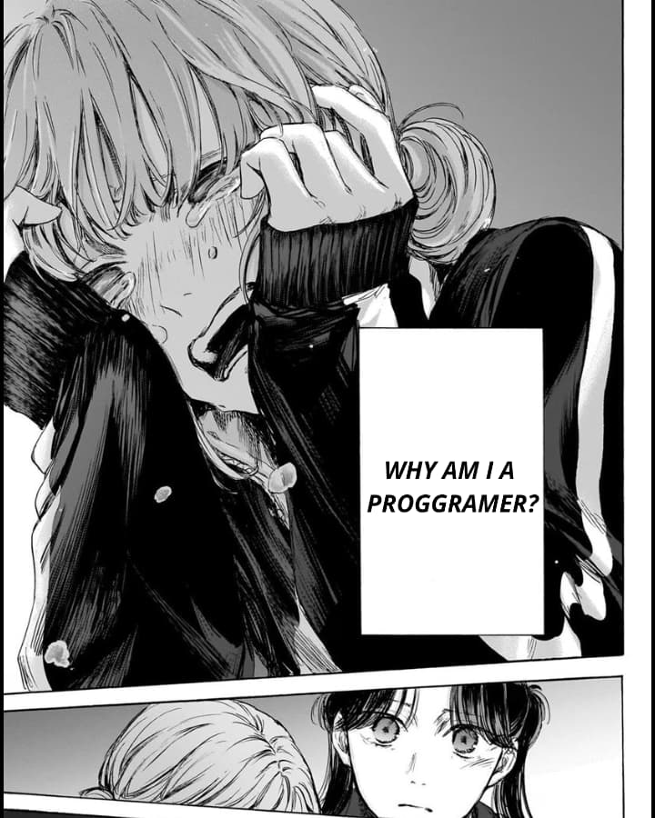

 <!--  -->

<h1 align="left">Hi, I'm Fazri Dwi Kurniawan</h1>

<h3 align="left">ABOUT ME :</h3>
<h4 align="left">A passionate Backend developer from Indonesia.</h4>

<h4>I am a Backend Developer specializing in building applications using PHP and Laravel, with experience in managing MySQL databases. I focus on creating efficient APIs, scalable systems, and secure, maintainable backend solutions.

###

<h3 align="left">SKILLS :</h3>

  
  
  
  
  
  
  
  
  
  
  
  
  
  
  
  
  
  
  
  
  

###

<h3> MY HOBBY :</h3>

- <h4>read book
- <h4>play game
- <h4>coding

#

  
  

###

<!--  -->

#

<h3 align="left">Connect with me:</h3>

  
  
  
  

###

<picture>
  <source media="(prefers-color-scheme: dark)" srcset="https://raw.githubusercontent.com/zeryj/zeryj/output/pacman-contribution-graph-dark.svg">
  <source media="(prefers-color-scheme: light)" srcset="https://raw.githubusercontent.com/zeryj/zeryj/output/pacman-contribution-graph.svg">
  
</picture>

#

 > <h2 align="left">"Programming isn’t about what you know it’s about what you can figure out."</h2>

<!--  -->

